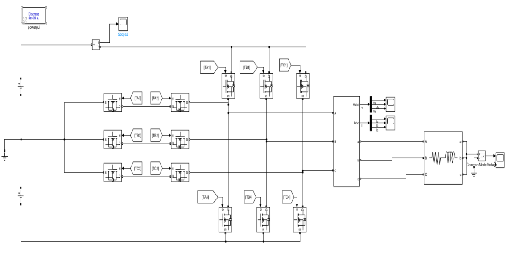
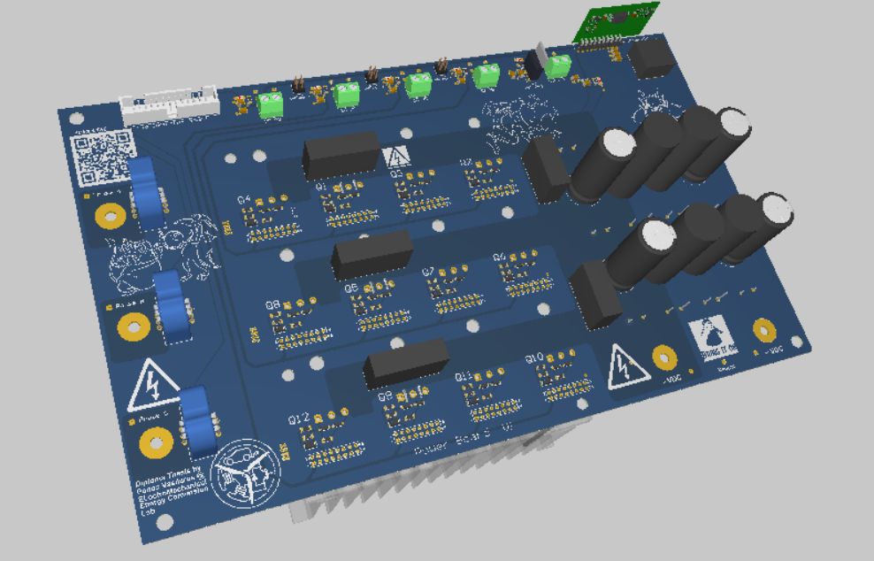
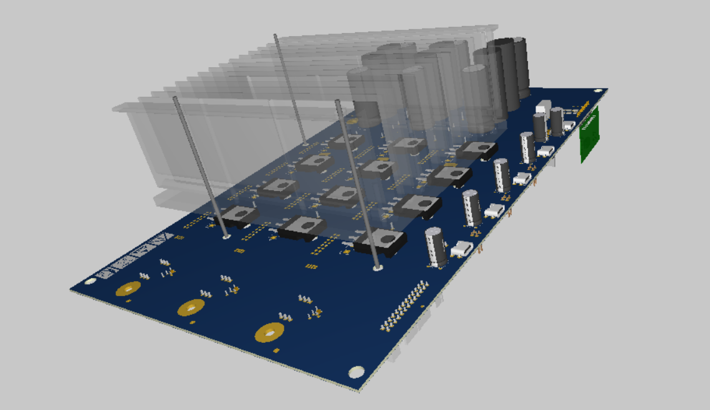

# Diploma Thesis
## _Design and Implementation of Multilevel Converter to drive 3phase Motor._
> [!NOTE]  
> More details, Simulink models, source code and comprehensive results will be uploaded as soon as the Thesis is published. 

## Overview
This repo presents the design and implementation of a T-Type inverter to drive a 3-phase Motor in the framework of my Diploma Thesis. 

### The following topic will be elaborated:
- System Modeling and  Modulation Techniques
- Motor Control Scheme
- PCB design
- STM programming 
- Experiments and results

## System Modeling and  Modulation Techniques
System Modeling using Matlab/Simulink

Modulation Techniques:
- Square Wave Modulation
- Pulse Width Modulation
- Level Shifted PWM
- Phase Shifted PWM
- Space Vector Modulation
### Results
#### _FFT Analysis_
> [!NOTE]  
> Will be uploaded soon...
####  _Common Mode Voltage_ 
> [!NOTE]  
> Will be uploaded soon...

## Motor Control Scheme
The designed and implemented control scheme to drive the 3phase Motor is the Indirect Field Oriented Control. 
The objective is to control either the torque or the speed of the motor.
> [!NOTE]  
> Will be uploaded soon...
## PCB Design
> [!NOTE]  
> Detailed info will be uploaded soon...

|    
|:--:| 
| *4-Layer PCB of the T-Type Inverter.* |

| 
|:--:| 
| *Prototype PCB* |
## STM programming
> [!NOTE]  
> Will be uploaded soon...
## Experiments and results
> [!NOTE]  
> Will be uploaded soon...
# Status  
- [x] Define System Parameters/Specs
- [x] System Modeling
- [x] Modulation Techniques and comparison
- [x] Dimensioning of electrical parts
- [x] Schematic Design
- [x] PCB design
- [x] PCB manufacturing and testing
- [ ] STM32 development
   - [x] Square Wave Modulation
   - [x] SPWM
   - [x] SVPWM
   - [x] V/F Control
   - [ ] FOC
- [ ] Testing
   - [x] Square Wave Modulation 
      - [x] Current and Voltage output
      - [x] Mosfet overvoltage
      - [x] DC bus capacitance
   - [ ] SVPWM
      - [ ] Current and Voltage output
      - [ ] Mosfet overvoltage
      - [ ] DC bus capacitance
   - [ ] Open Loop Control
   - [ ] Closed Loop Contro
